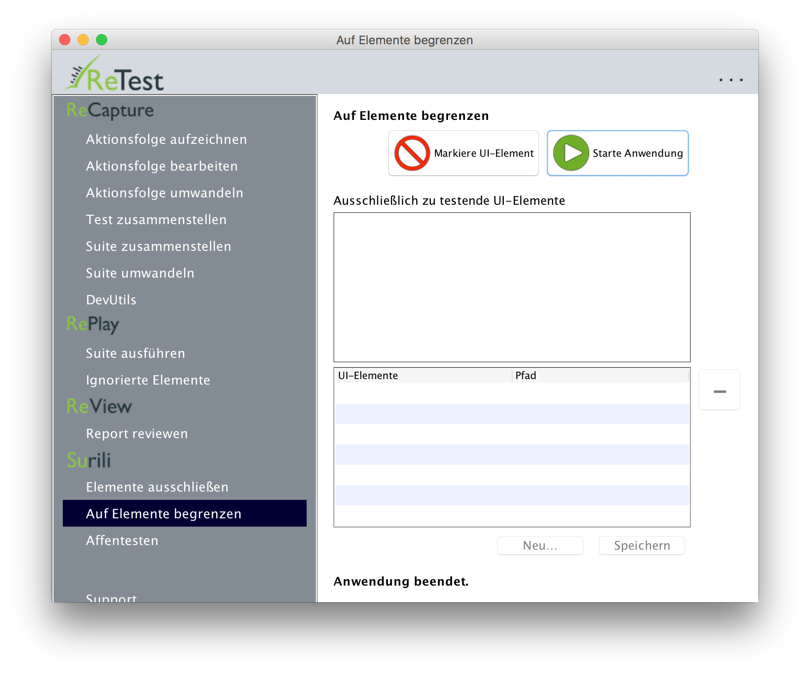

Die 2-Minuten Surili-Tour mit der ReTest Demo
=============================================

Mit ReTest brauchen Sie die Tests nicht Mal selbst aufzuzeichnen! Nutzen Sie zum Erzeugen der Tests einfach unseren digitalen Affen – Surili.

Affentesten eingrenzen
----------------------

Um nicht die ganze Anwendung auf einmal zu testen, sondern bspw. modulweise vorzugehen, klicken Sie auf den Menüpunkt "Auf Elemente begrenzen".

