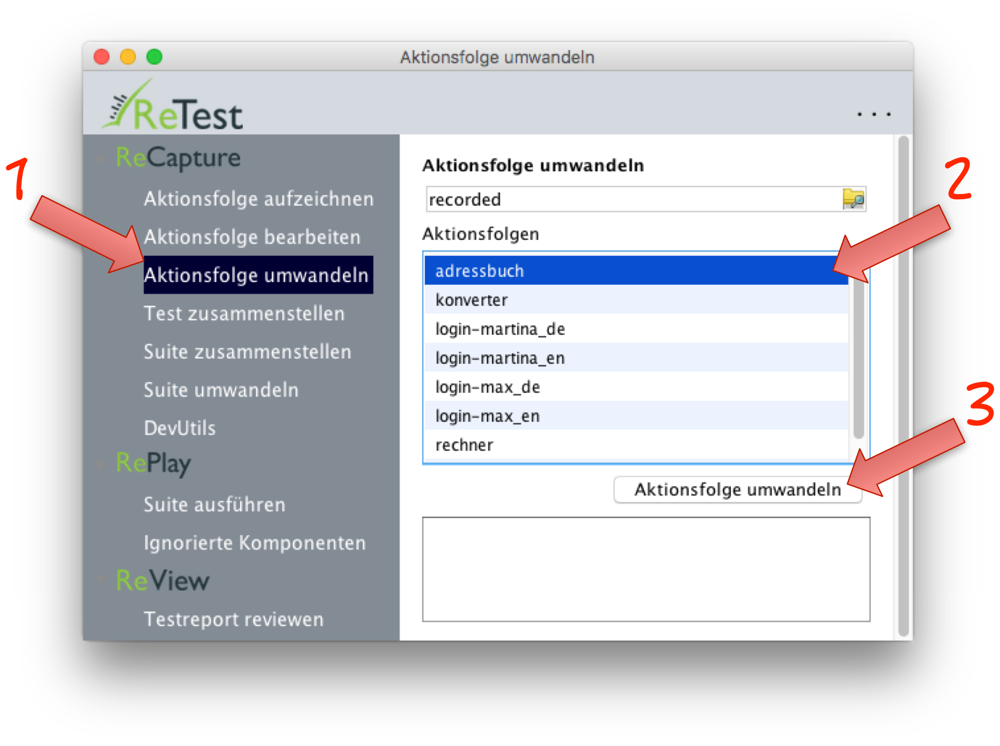

Umwandeln einer vollständigen Aktionsfolge
==========================================

Damit Sie eine Aktionsfolge als komplette Suite ausführen können müssen Sie sie zuerst umwandeln. 
Dazu haben Sie [mehrere Möglichkeiten](wie-man-einen-test-aufzeichnet.html). 
Eine Möglichkeit besteht darin, die Aktionsfolge direkt als Suite umzuwandeln.

Dazu klickt man im Menü auf "Aktionsfolge umwandeln". Dann suchen Sie in der Liste der Aktionsfolgen diejenige heraus, die Sie umwandeln möchten.
Dann klicken Sie auf den Button "Aktionsfolge umwandeln". Nun wird die komplette Aktionsfolge nochmals abgespielt und mit den Zustandsinformationen von der GUI (alle angezeigten Werte und mehr) angereichert.  
 

Diese Aktionsfolge können Sie nun [ausführen](suite-ausfuehren.html).