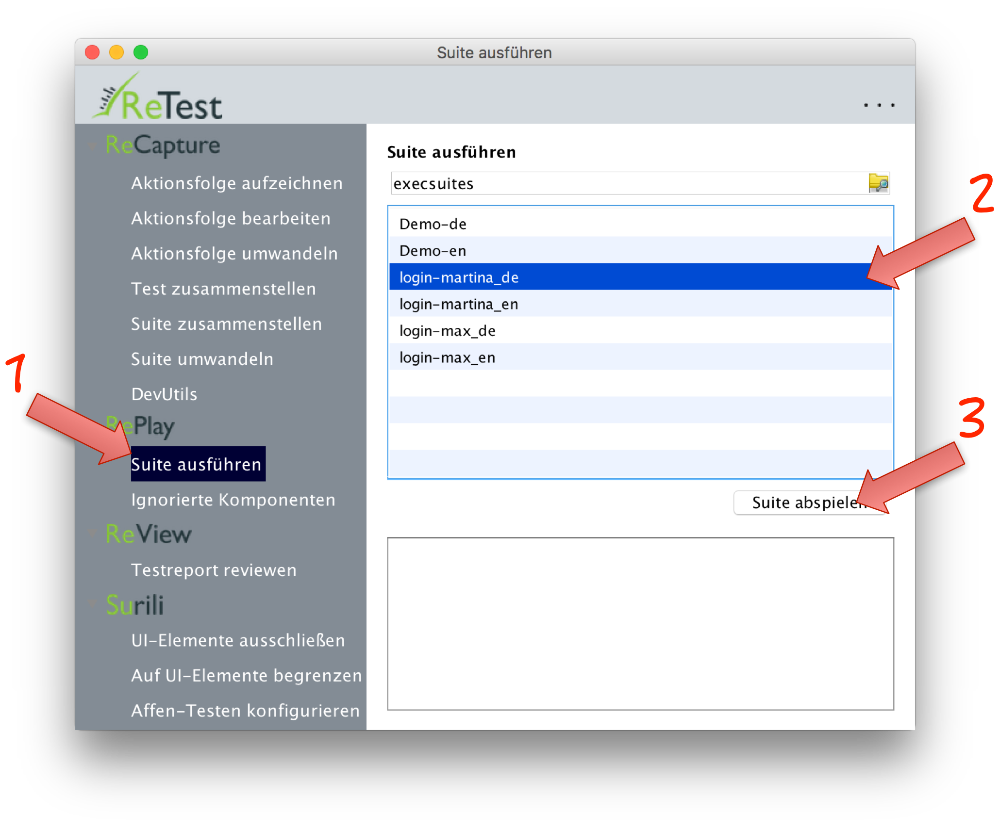

Suite ausführen
===============

Um eine Suite auszuführen klicken Sie im Menü auf den Menü-Punkt "Suite ausführen". 
Danach wählen Sie die bereits umgewandelte Suite aus. 
Eine [erstellte Suite](../recapture/suite-zusammenstellen.html) oder [aufgezeichnete Aktionsfolge](../recapture/aktionsfolge-aufzeichnen.html) die noch nicht [umgewandelt](../recapture/aktionsfolge-umwandeln.html) wurde, 
kann noch nicht wieder abgespielt werden.

Nachdem Sie die Suite ausgewählt haben, klicken Sie auf "Suite abspielen". 
Danach wird die Suite abgespielt und der Fortschritt im Log-Bereich dokumentiert.

Nachdem die Suite abgespielt wurde öffnet sich automatisch die Maske zum [reviewen der Testergebnisse](../review/ergebnisse-reviewen.html). 
