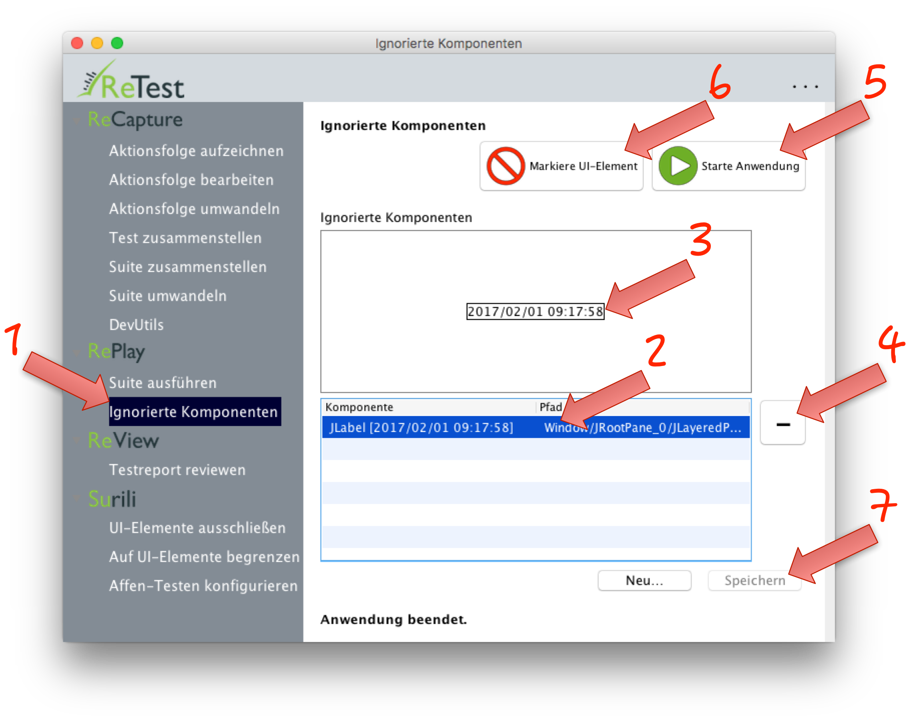

UI-Elemente ignorieren
======================

ReTest erlaubt es auch UI-Elemente dauerthaft zu ignorieren.

 Achtung: Unterschiede in ignorierten UI-Elemente *und allen Kind-Elementen* werden dauerhaft ausgeblendet.

Dazu kann man entweder nach der Ausführung einer Suite [beim Review die Elemente ignorieren](../review/ui-elemente-ignorieren.md)
oder diese bereits vorher in der Anwendung markieren.

Außerdem kann man prüfen, welche UI-Elemente derzeit ignoriert werden. 
Dazu klicken Sie im Menü auf "UI-Elemente ignorieren" (1).
In der Tabelle sehen Sie alle UI-Elemente die derzeit ignoriert werden (2).
Wenn Sie auf eines klicken, so wird im Feld darüber ein Screenshot von diesem Element geladen (3).
Durch einen Klick auf das Minus-Symbol können Sie UI-Elemente entfernen – diese werden dann künftig wieder überprüft.

