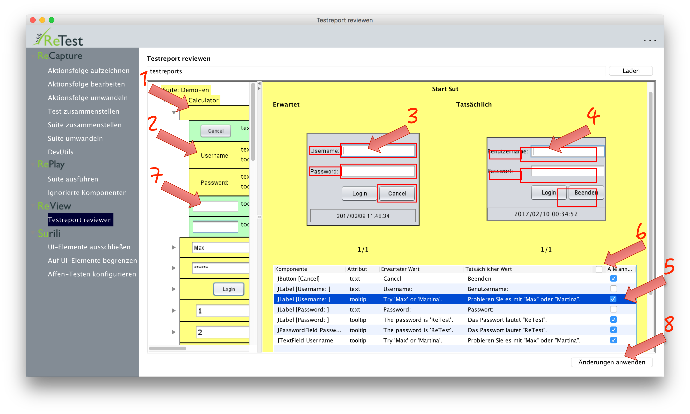
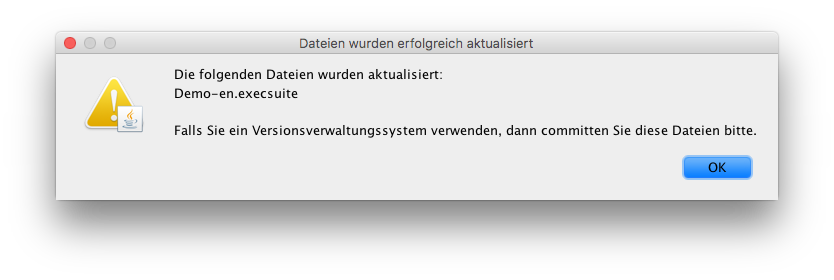

Unterschiede
============

Werden beim Vergleich der Attribute der Elemente Unterschiede festgestellt, so werden diese Unterschiede in der Detailansicht angezeigt.

Die Unterschiede werden pro Aktion angezeigt (1), sind in der Baumstruktur aber auch nochmal nach Struktur gruppiert (2).
In der Detail-Ansicht wird ein Screenshot der Maske mit dem Zustand während der Umwandlung angezeigt, und alle Unterschiede sind im Screenshot rot markiert (3).
Daneben wird der Zustand der Maske beim Abspielen angezeigt. Die Markierungen aus dem erwarteten Zustand sind angezeigt, um zu verdeutlichen, wo die Elemente erwartet worden währen (4).

In der Tabelle darunter hat man die Möglichkeit die gewollten Unterschiede einzeln mit einem Haken zu markieren (5).
Optional kann man auch alle Unterschiede auf einmal annehmen mit einem Klick in "Alle anehmen" im Tabellen-Header (6). 
Nach dem Annehmen werden die Elemente in der Baumstruktur, bei denen alle Unterschiede angenommen wurden, entsprechend grün markiert (7).
Wurden alle Unterschiede in der Aktion angenommen, wird auch die Aktion grün markiert.
Wurden alle Unterschiede in allen Aktionen angenommen, so wird der Test grün markiert.
Und wurden alle Unterschiede in allen Tests angenommen, so wird die Suite grün markiert.

Um die solchermaßen bestätigten Unterschiede dauerhaft zu speicher und damit gleich die Suites zu pflegen, muss man nun noch auf "Änderungen anwenden" (8) klicken.
Verwendet man ein [Versionskontrollsystem](../testprozess/prozess-mit-ci-server.md), so muss man in diesem die aktualisierten Suites noch kommitten.

Es besteht auch die Möglichkeit [Unterschiede dauerhaft zu ignorieren](ui-elemente-ignorieren.md).