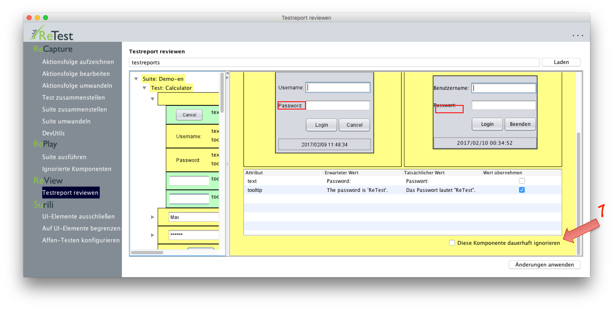

UI-Elemente dauerhaft ignorieren
================================

Man auch die Möglichkeit UI-Elemente dauerhaft zu ignorieren.

Grundsätzlich sollte man versuchen eine [stabile Testumgebung](/testprozess/stabile-testumgebung.md) aufzubauen.
Trotzdem gibt es dann immernoch volatile Elemente, wie das Tagesdatum oder die Build-Version.
Obwohl dies je nach Anwendung natürlich variiert, so sollte sich die Anzahl dieser Elemente unserer Erfahrung nach jedoch in Grenzen halten.

Um ein Element dauerhaft zu ignorieren kann man es direkt [in der Anwendung markieren](../replay/komponenten-ignorieren.md), 
oder es im Nachgang beim [Reviewen der Ergebnisse](ergebnisse-reviewen.md) markieren.

Dazu muss man entweder in der Tabelle auf das Element klicken oder das Element in der Baumansicht auswählen.

 Achtung: Unterschiede in ignorierten Elementen *und allen Kind-Elementen* werden dauerhaft ausgeblendet.

Man kann sich sich auch jederzeit [anschauen](../replay/komponenten-ignorieren.md), welche Elemente derzeit ignoriert werden.
