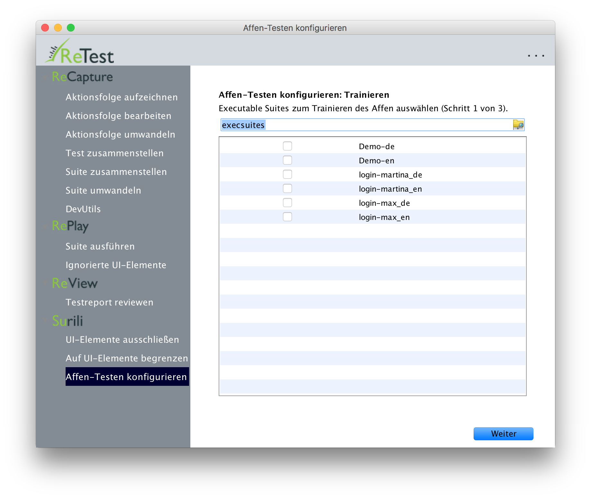
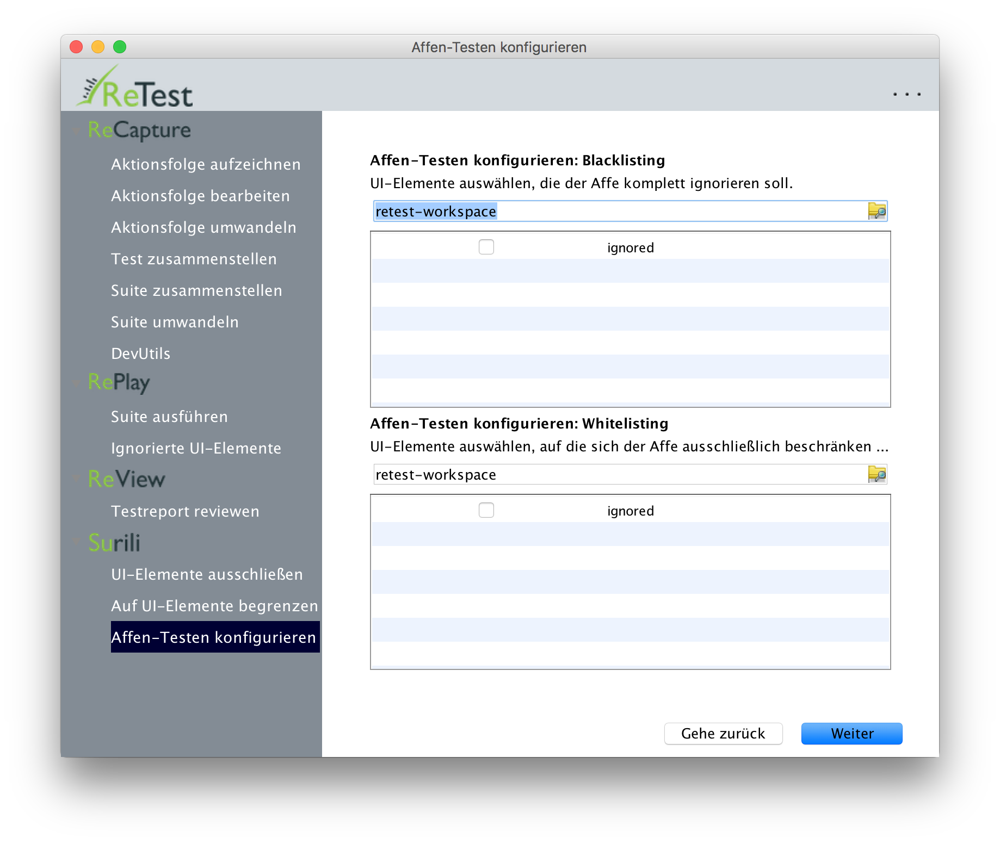
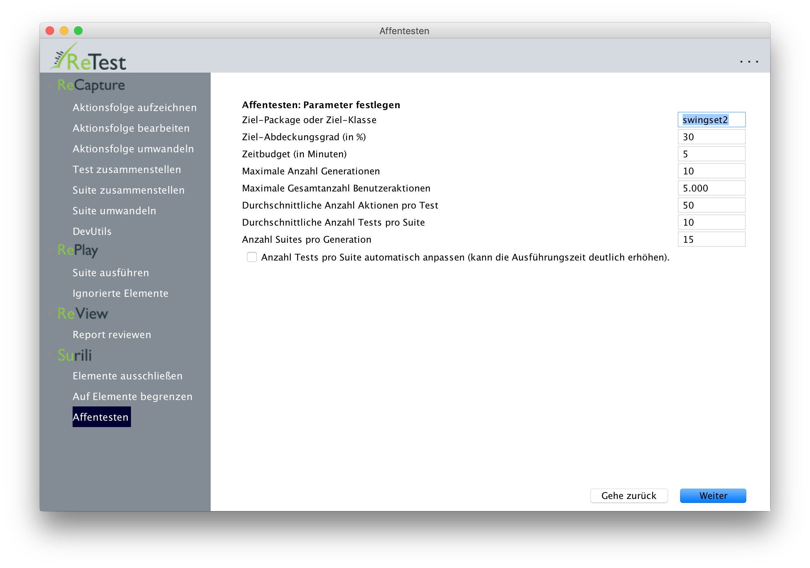
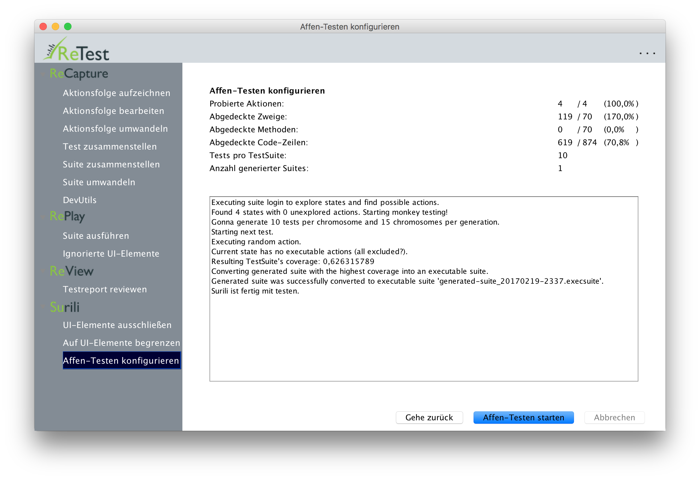

Affentesten
===========

Das Affentesten (Englisch "Monkey Testing") einer [SUT](../testprozess/was-ist-die-sut.md) kann man über den Menü-Punkt "Affentesten" starten.
Beim Affentesten wird unser digitaler Affe genannt Surili (nach der Affenart die auf der Insel Java lebt) Ihre SUT mit zufälligen Eingaben traktieren.

Unser Affe wird dabei zwei Dinge gleichzeitig tun:

* Er kann die SUT auf Robustheit Testen und Abstürze und Fehler suchen. Findet er einen Fehler bzw. bringt er die SUT zum Absturz, so exportiert er den zugehörigen Test als ausführbare Suite samt HTML-Bericht in den [`crashes`-Ordner im Workspace](../konfiguration/verzeichnisse.md).
* Er kann eine ausführbare Suite erzeugen, welche bereits mit Zustandsdaten angereichert ist, und direkt [in den CI-Prozess integriert werden kann](../testprozess/prozess-mit-ci-server.md), um jede Nacht die SUT auf Änderungen zu prüfen.

Aus mehreren Gründen empfiehlt es sich im Allgemeinen nicht die komplette Anwendung auf einmal testen zu wollen, sondern Masken-, Modul- oder Packetweise vorzugehen.
Einer der Gründe besteht ganz einfach darin, dass die Künstliche Intelligenz des Affen versucht eine möglichst hohe Code-Abdeckung zu erreichen.
Testet man die gesamte SUT auf einmal, so wird der Affe jede einzelne Maske nur sehr oberflächlich und mit wenigen Eingaben testen.
Konzentriert man den Affen dagegen auf eine einzelne Maske oder ein einzelnes Modul, so wird er dieses wesentlich intensiver testen und folglich mehr Fehler zutage fördern.

Den Affen trainieren
--------------------

Auf der ersten Maske des Wizard kann man die Suites auswählen, mit denen der Affe trainiert werden soll.
Dies ist sinnvoll, um dem Affen z.B. das Anmelden an der SUT oder das Navigieren zu einer bestimmten Maske zu zeigen, 
sowie um ihm den Happy Path eines Anwendungsfalles zu zeigen.

Black- und Whitelisting
-----------------------

Auf der zweiten Maske des Wizard kann man das Black- und Whitelisting von UI-Elementen konfigurieren.
Das Blacklisting dient dazu dem Affen bestimmte potentiell kritische UI-Elemente komplett zu verbieten.
Sinnvollerweise zählen dazu bspw. ein "Drucken"-Knopf, ein "Email senden"-Knopf oder ein "Atomraketen starten"-Knopf.

Das Whitelisting dient dazu den Affen auf bestimmte Masken oder Module zu fokusieren.
Dies ist z.B. sinnvoll falls man sich nicht sicher ist, ob man alle kritischen UI-Elemente mittels Blacklisting "verboten" hat.

Mit Hilfe seiner Künstlichen Intelligenz und der integrierten Abdeckungsanalyse wird der Affe sich langfristig auf das Konfigurierte Modul bzw. Packet konzentrieren.
Zuvor wird er jedoch versuchen einmal alle Eingabeelemente der SUT auszuprobieren, um alle Möglichkeiten zu entdecken, wie er Funktionalität im Zielpacket ausführen kann.
Dieser Prozess kann je nach Größe und Komplexität der SUT sehr lange dauern.
Deshalb kann es außerdem sehr sinnvoll den Affen auf Masken zu fokusieren, um den Testprozess enorm zu beschleunigen.

Den Affen konfigurieren
-----------------------

Auf der dritten Maske des Wizard kann die wichtigsten Konfigurationparameter des Affen festlegen:

* **Das Ziel-Package oder die Ziel-Klasse:** Hier können Sie angeben, für welches Packet oder welche Java-Klasse 
  der Affe versuchen soll die Code-Abdeckung der Tests zu optimieren.
  Sie können hier einen beliebigen Präfix angeben.
* **Ziel-Abdeckungsgrad (in %):** Hier können Sie angeben, welchen Abdeckungsgrad der Affe versuchen soll für das konfigurierte Packet oder die Klasse zu erreichen.
  Wir der Abdeckungsgrad erreicht oder überschritten, so beendet der Affe das Testen.
* **Zeitbudget:** Hier können Sie bspw. angeben, ob der Affe die ganze Nacht oder nur 2 Stunden testen soll.
* **Maximale Anzahl Generationen:** Hier können Sie angeben, wie viele Generationen der zugrunde liegende Genetische Algorithmus verwenden darf.
* **Maximale Gesamtanzahl Benutzeraktionen:** Ein weiteres Abbruchkriterium.
* **Durchschnittliche Anzahl Aktionen pro Test:** Hier können Sie wählen, wie lang die erzeugten Tests im Schnitt sein sollen. 
  Kürzere Tests sind einfacher nachzuvollziehen, längere Tests haben eine größere Abdeckung und sind effizienter und einfacher zu erzeugen.
* **Durchschnittliche Anzahl Tests pro Suite:** Hier können Sie wählen, wie groß die erzeugte Suite ca. sein soll.
  Kürzere Suites sind im nächtlichen CI-Prozess schneller aber schwieriger zu generieren.
* **Anzahl Suites pro Generation:** Hier können Sie angeben, wie groß eine Generationen des zugrunde liegenden Genetischen Algorithmus sein darf.
* **Anzahl Tests pro Suite automatisch anpassen:** Hier versucht unser Algorithmus heuristisch die Anzahl der Tests pro Suite auf die Anzahl der Interaktionselemente anzupassen.

Den Affen starten
-----------------

Nachdem Sie den Affen konfiguriert haben, können Sie auf "Affentesten starten" klicken.
Dann wird der Affe zunächst trainiert, d.h. die ausgewählten Suites werden ausgeführt, und der Affe analysiert diese bei der Ausführung.
Danach wird der Affe basierend auf diesem Wissen beginnen die SUT systematisch auszuführen und zunächst alle UI-Elemente (je nach Black-/Whitelisting) ausprobieren.
In einem dritten Schritt wird der Affe nun so lange die Tests abwandeln und neu zusammenfügen, 
bis entweder ein Abbruchkriterium erreicht ist, 
bis der Nutzer auf "Abbrechen" klickt, 
oder bis der Affe für mindestens TODO Generationen die Abdeckung nicht mehr erhöhen kann.

Als Endergebnis erzeugt der Affe ein ausführbare Suite, die er im [`execSuites`-Verzeichnis im Workspace](../konfiguration/verzeichnisse.md) ablegt.
Diese Suite kann natürlich in einem weiteren Durchgang wiederrum zum Trainieren des Affen genutzt werden.
Somit kann ein iterativer Prozess realisiert werden, in welchem Beispielsweise der Affe jeden Tag wenige Stunden testet
und die Ergebnisse des Vortages am nächsten Tag weiter verwendet werden.

Stößt der Affe während des Testens auf einen Fehler, so wird er einen neuen Ordner mit dem Fehlertyp (bspw. `java.lang.NullPointerException`) sowie Datum und Uhrzeit als Namen
im Verzeichnis [`crashes` im Workspace](../konfiguration/verzeichnisse.md) anlegen, und dort die zugehörige ausführbare Suite und einen HTML-Bericht ablegen, 
in welchem der Test Schritt für Schritt inklusive Screenshots beschrieben ist. 
